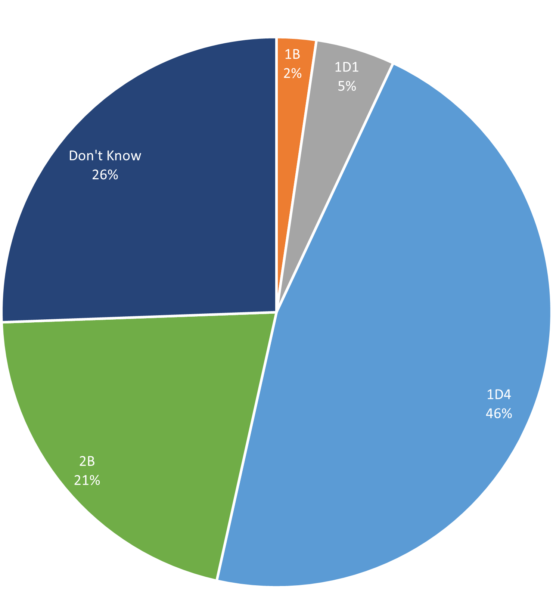
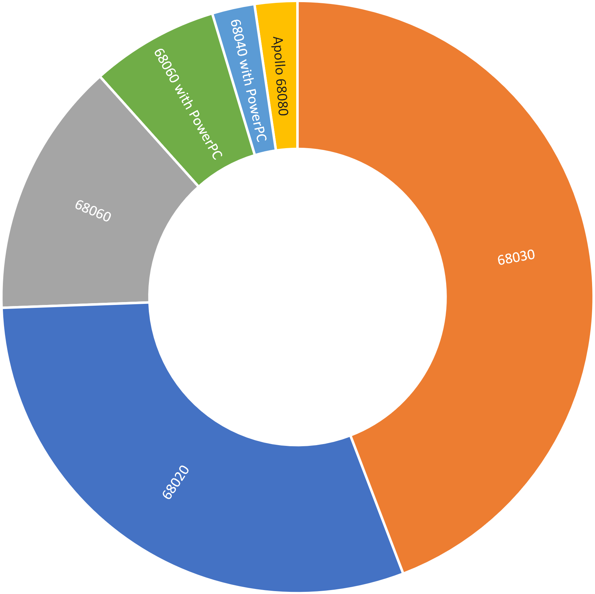
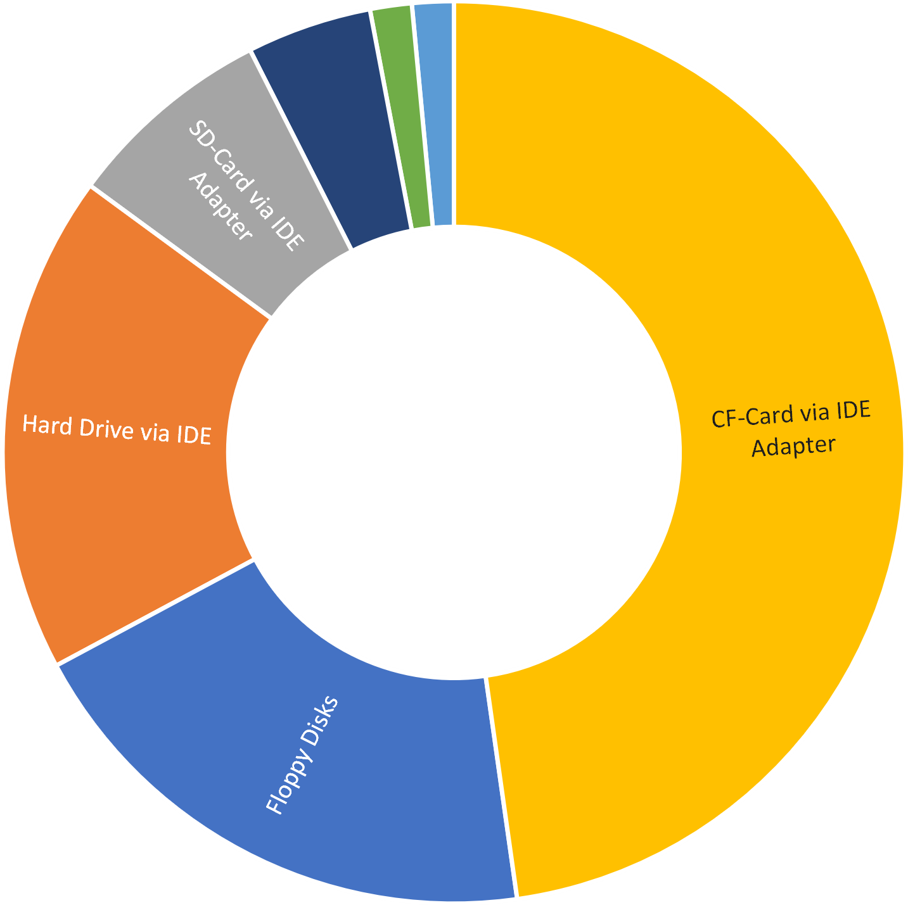
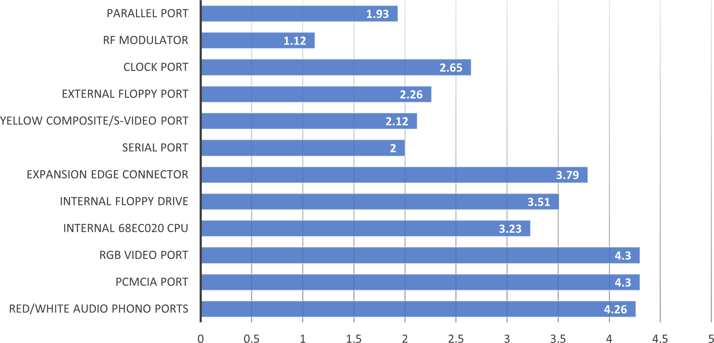

# Amiga 1200 in 2020

In mid 2020, Betajaen released a survey on [Survey Planet](https://www.surveyplanet.com). Which was open to all Commodore Amiga 1200 users in asking questions of their Amiga 1200 setup.

These are the results to those questions which are open to all to use.

## 1. What is your Amiga 1200 Revision?

Question was presented as a single choice

| Revision   | Count |
| ---------- | :-----: |
| 1A         | 0     |
| 1B         | 1     |
| 1D1        | 2     |
| 1D3        | 0     |
| 1D4        | 20    |
| 2B         | 9     |
| Don't Know | 11    |

## 2. What is your CPU?

Question was presented as a single choice

| CPU             | Count |
| ------------------ | :-----: |
| 68020 (Default)    | 13    |
| 68030              | 19    |
| 68040              | 0     |
| 68060              | 6     |
| Apollo 68080       | 1     |
| 68040 with PowerPC | 1     |
| 68060 with PowerPC | 3     |

## 3. How many megabytes of "Fast RAM" do you have?

Question was presented as a slider between 0 and 256 megabytes.

| Amount | Count |
| ------ | :-----: |
| 0      | 1     |
| 4      | 4     |
| 6      | 1     |
| 8      | 10    |
| 16     | 2     |
| 32     | 3     |
| 64     | 9     |
| 96     | 1     |
| 128    | 8     |
| 160    | 1     |
| 256    | 3     |

| Function | Value |
| ----| -------|
| Min | 0 Mb |
| Max | 256 Mb |
| Average | 66.4 Mb |
| Mode | 8 Mb |

## 4. How do you store your files on your Amiga?

Question was presented as multiple choice.

| Storage Medium | Count |
| ------------------ | :-----: |
| Floppy Disks |	13 |
| Hard Drive via IDE |	12 |
| SD-Card via IDE Adapter | 5 |
| CF-Card via IDE Adapter |	32 |
| SSD via IDE Adapter |	1 |
| Harddrive via SCSI Adapter |	1 |
| USB Media via USB Adapter |	3 |
| Other	| 5 |

## 5. What region is your Amiga 1200?

Question was presented as a single choice.

| Region | Count |
| ----- | :-----: |
| PAL | 41 |
| NTSC | 2 |
| Don't Know| 0 |

## 6. How else have you expanded your Amiga 1200?

Question was presented as a multiple choice, with in a custom answer for "Other"

| Component | Count |
| -------|:-----:|
| 3.1.4 or Custom Kickstarts	| 16|
| CD or DVD-ROM	| 13|
| External Floppy	Drive |	10 |
| External Keyboard	| 6 |
| Fast ATA	| 4|
| Gotek Floppy	| 13 |
| IDE Expansion (via IDE port)	| 5 |
| Indivision/Scandoubler/Flickerfixer	| 8|
| Mediator	| 3 |
| Modem	| 2|
| Non-AGA Graphics Card	| 4 |
| Non-Commodore PSU	| 14 |
| Null Modem Cable	| 7 |
| PCMCIA Card	| 23|
| PCMCIA Ethernet/WiFi Network	| 21|
| PCMCIA Memory	| 0|
| Plipbox	| 3|
| Printer	| 1|
| Real-time Clock	| 22 |
| Sound Card	| 4|
| Tower (A1200T)	| 4|
| USB	| 7|

### Other Answers

1. Micronic tower, G-Rex, Voodoo 3, ethernet card 10/100Mbit.
2. trapdoor memory expansion
3. ACA1232
4. Squirell, Graphics tablet, FPU etc.
5. Aca1221ec
6. PrismaMix

## 7. Have you had fixes, repairs or additions done to the A1200 Motherboard?

Question was presented as a multiple choice, with in a custom answer for "Other"

| Repair | Count |
| ------ |:-----:|
| Capacitors Replaced |	30 |
| Timing Fixes |	9 |
| PCMCIA Reset Fix |	8 |
| RF Modulator Removed |4 |
| Other	| 0 |

No other answers were provided.

## 8. How relevant would you say these components of the Amiga 1200 is in every day usage in 2020?

Question was presented as score for each component, from 1 to 5; where 1 is not Relevant and 5 is very relevant.

| Component | Score | Average |
| ----------| :----: | :------: |
| Clock Port |	114 |	2.65 |
| Expansion Edge Connector	| 163 |	3.79 |
| External Floppy Port	| 97	| 2.26 |
| Internal 68EC020 CPU	| 139	| 3.23 |
| Internal Floppy Drive |	151	| 3.51 |
| Parallel Port	| 83	| 1.93 |
| PCMCIA Port	| 185	| 4.3 |
| Red/White Audio Phono Ports |	183	| 4.26 |
| RF Modulator | 48	| 1.12 |
| RGB Video Port | 185 |	4.3 |
| Serial Port	| 86 | 2 |
| Yellow Composite/S-Video Port	| 91 | 2.12 |

## 9. If the following could be added to the Amiga 1200 Motherboard. Which of the following would mean the most to you.

Question was presented as a single choice.

| Addition | Count |
| -------- | :----:|
| 3.5mm Audio Output |	1 |
| Bluetooth Audio Output |	0 |
| Bluetooth Input (Mouse, Joystick or Keyboard) |	0 |
| Ethernet or WiFi |3 |
| HDMI or DVI Video Output |	21 |
| USB Input (Mouse, Joystick or Keyboard) | 9 |
| USB Media (USB Stick, External CD-ROM, External Harddrive) |	7 |

## 10. If the following could be added to the Amiga 1200 Motherboard. Which of the following would mean the least to you.

| Addition | Count |
| ---------| :----: |
| 3.5mm Audio Output |	13 |
| Bluetooth Audio Output |	15 |
| Bluetooth Input (Mouse, Joystick or Keyboard)	| 5 |
| Ethernet or WiFi | 3 |
| HDMI or DVI Video Output |	1 |
| USB Input (Mouse, Joystick or Keyboard) |	2 |
| USB Media (USB Stick, External CD-ROM, External Harddrive) |	2 |
